# 军队乡村振兴管理系统 — 系统设计图集（补充篇）

**版本**: 1.1.0 | **生成日期**: 2026-04-26 | **格式**: Mermaid

---

## 目录

| # | 图表 | 类型 |
|---|------|------|
| 12 | [系统用例图](#12-系统用例图) | 用例 |
| 13 | [C4 系统上下文图](#13-c4-系统上下文图) | C4 模型 |
| 14 | [C4 容器图](#14-c4-容器图) | C4 模型 |
| 15 | [RBAC 权限模型图](#15-rbac-权限模型图) | 权限模型 |
| 16 | [缓存失效策略图](#16-缓存失效策略图) | 缓存架构 |
| 17 | [错误处理与异常流程图](#17-错误处理与异常流程图) | 异常处理 |
| 18 | [日志与监控架构图](#18-日志与监控架构图) | 可观测性 |
| 19 | [安全防护层次图](#19-安全防护层次图) | 安全架构 |
| 20 | [数据库迁移双轨流程图](#20-数据库迁移双轨流程图) | 迁移机制 |
| 21 | [构建流水线详细时序图](#21-构建流水线详细时序图) | CI/CD |
| 22 | [离线地图瓦片架构图](#22-离线地图瓦片架构图) | 离线地图 |
| 23 | [消息通知流程图](#23-消息通知流程图) | 通知系统 |
| 24 | [系统配置层级图](#24-系统配置层级图) | 配置管理 |
| 25 | [数据包加密传输流程图](#25-数据包加密传输流程图) | 数据安全 |

---

## 12. 系统用例图

```mermaid
graph TB
    subgraph ACTORS["外部参与者"]
        SA["超级管理员<br/>Super Admin"]
        ADMIN["管理员<br/>Admin"]
        MGR["管理岗<br/>Manager"]
        APPROVER["审批岗<br/>Approval Leader"]
        VIEWER["查看者<br/>Viewer"]
    end

    subgraph SYS["军队乡村振兴管理系统"]
        subgraph UC_AUTH["认证与用户管理"]
            UC1["登录/登出"]
            UC2["用户管理"]
            UC3["角色权限配置"]
            UC4["菜单权限管理"]
        end

        subgraph UC_BIZ["核心业务"]
            UC5["帮扶村管理<br/>CRUD + 年度数据"]
            UC6["帮扶学校管理<br/>CRUD + 资助学生"]
            UC7["帮扶项目管理<br/>全生命周期"]
            UC8["经费管理<br/>申请/审批/拨付/决算"]
            UC9["政策法规管理"]
        end

        subgraph UC_WORKFLOW["审批与工作流"]
            UC10["发起审批申请"]
            UC11["审批任务处理"]
            UC12["审批历史查看"]
        end

        subgraph UC_DATA["数据管理"]
            UC13["数据导入导出"]
            UC14["数据包上报/接收"]
            UC15["数据同步与冲突解决"]
            UC16["数据备份与恢复"]
        end

        subgraph UC_ANALYTICS["数据分析"]
            UC17["工作台 Dashboard"]
            UC18["地图可视化"]
            UC19["统计报表"]
            UC20["考核评估"]
        end

        subgraph UC_SYSTEM["系统管理"]
            UC21["系统健康监控"]
            UC22["审计日志查看"]
            UC23["系统配置管理"]
            UC24["机器码管理"]
        end
    end

    SA --> UC1 & UC2 & UC3 & UC4 & UC21 & UC22 & UC23 & UC24
    ADMIN --> UC1 & UC2 & UC3 & UC5 & UC6 & UC7 & UC8 & UC9 & UC11 & UC12
    ADMIN --> UC13 & UC14 & UC15 & UC16 & UC17 & UC18 & UC19 & UC20 & UC21 & UC22
    MGR --> UC1 & UC5 & UC6 & UC7 & UC8 & UC9 & UC13 & UC14 & UC17 & UC18 & UC19
    APPROVER --> UC1 & UC10 & UC11 & UC12 & UC17
    VIEWER --> UC1 & UC12 & UC17 & UC19
```

---

## 13. C4 系统上下文图

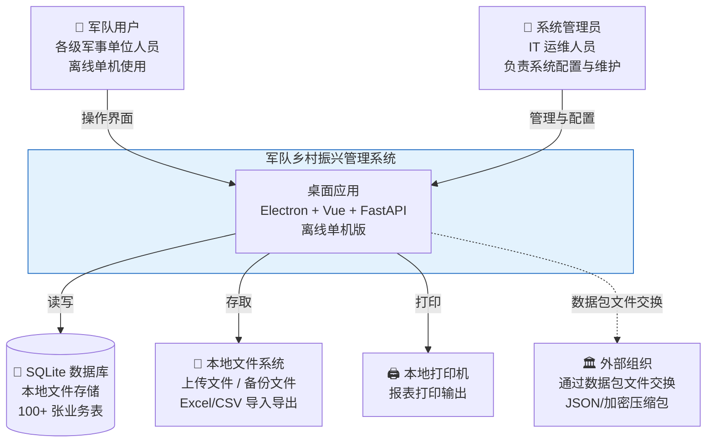

---

## 14. C4 容器图

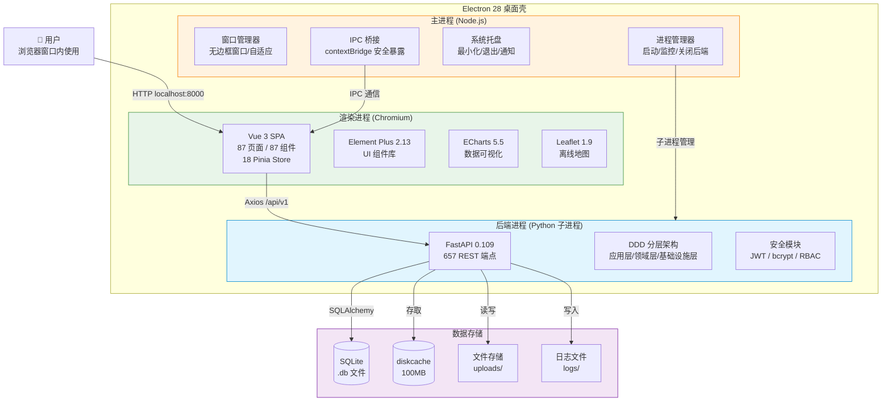

---

## 15. RBAC 权限模型图

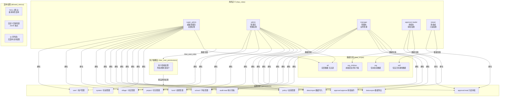

---

## 16. 缓存失效策略图

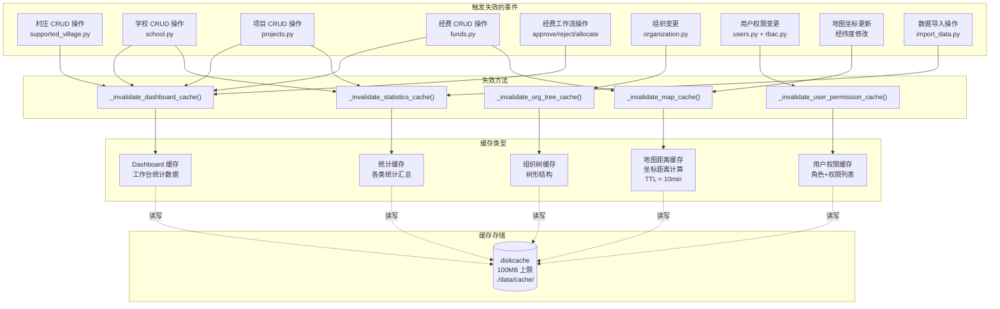

---

## 17. 错误处理与异常流程图

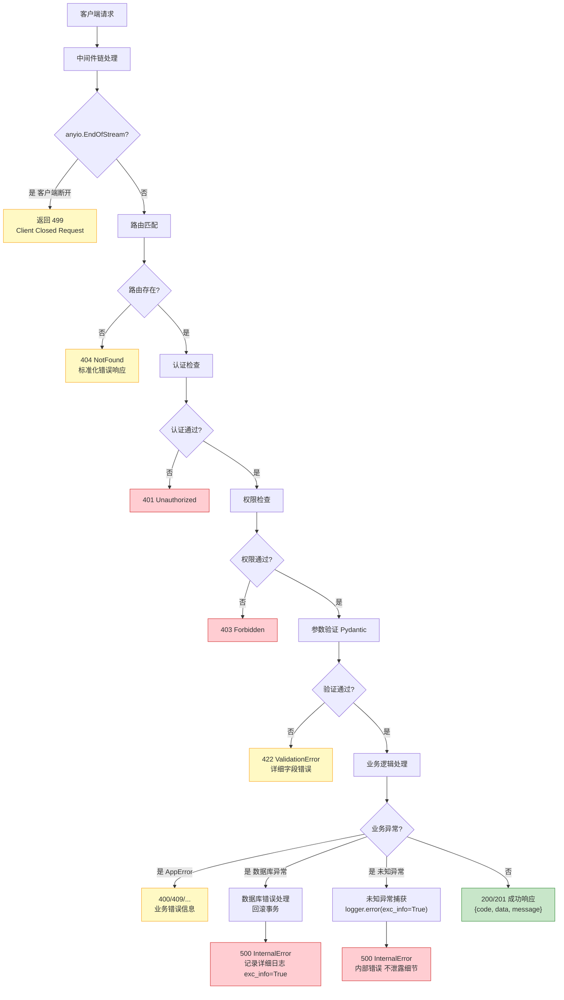

---

## 18. 日志与监控架构图

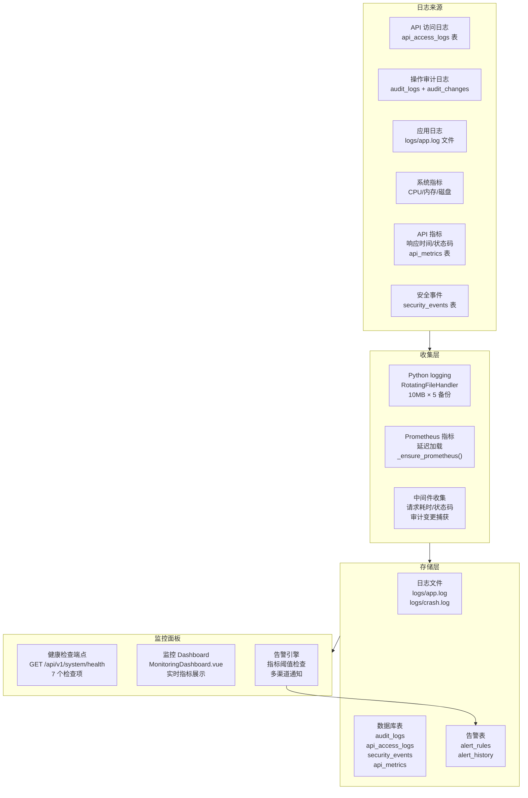

---

## 19. 安全防护层次图

```mermaid
graph TB
    subgraph L1["第一层: 网络与传输安全"]
        L1A["CSRF 防护<br/>SameSite=Lax + Secure"]
        L1B["速率限制<br/>IP 级别请求频率控制"]
        L1C["CORS 控制<br/>同源策略检查"]
    end

    subgraph L2["第二层: 认证安全"]
        L2A["JWT Token<br/>HS256 签名 + 8h 有效期"]
        L2B["bcrypt 密码加密<br/>10 轮 salt"]
        L2C["Token 黑名单<br/>SQLite 存储已撤销 Token"]
        L2D["双因素认证<br/>TOTP + 备用码"]
        L2E["登录保护<br/>失败计数 + 账户锁定"]
    end

    subgraph L3["第三层: 授权与权限"]
        L3A["RBAC 角色权限<br/>7 张权限表"]
        L3B["数据范围过滤<br/>all/org_children/org/self"]
        L3C["菜单权限<br/>allowed_menus 控制"]
        L3D["路由守卫<br/>前端权限拦截"]
    end

    subgraph L4["第四层: 数据安全"]
        L4A["SQL 注入防护<br/>SQLAlchemy 参数化查询"]
        L4B["XSS 防护<br/>DOMPurify 输入消毒"]
        L4C["AES-256 加密<br/>备份文件 + 数据包"]
        L4D["SHA-256 校验<br/>数据完整性验证"]
    end

    subgraph L5["第五层: 审计与追溯"]
        L5A["操作审计日志<br/>全操作记录 + 变更明细"]
        L5B["安全事件记录<br/>告警 + 响应追踪"]
        L5C["API 访问日志<br/>端点/耗时/状态码"]
        L5D["数据导出日志<br/>导出类型/记录数/文件"]
    end

    subgraph L6["第六层: 运行时安全"]
        L6A["Electron 沙箱<br/>contextBridge IPC 隔离"]
        L6B["进程隔离<br/>前端 Chromium / 后端 Python"]
        L6C["机器码绑定<br/>硬件指纹授权"]
    end

    L1 --> L2 --> L3 --> L4 --> L5 --> L6

    style L1 fill:#e3f2fd,stroke:#1565c0
    style L2 fill:#e8f5e9,stroke:#2e7d32
    style L3 fill:#fff3e0,stroke:#ef6c00
    style L4 fill:#fce4ec,stroke:#c62828
    style L5 fill:#f3e5f5,stroke:#6a1b9a
    style L6 fill:#e0f2f1,stroke:#00695c
```

---

## 20. 数据库迁移双轨流程图

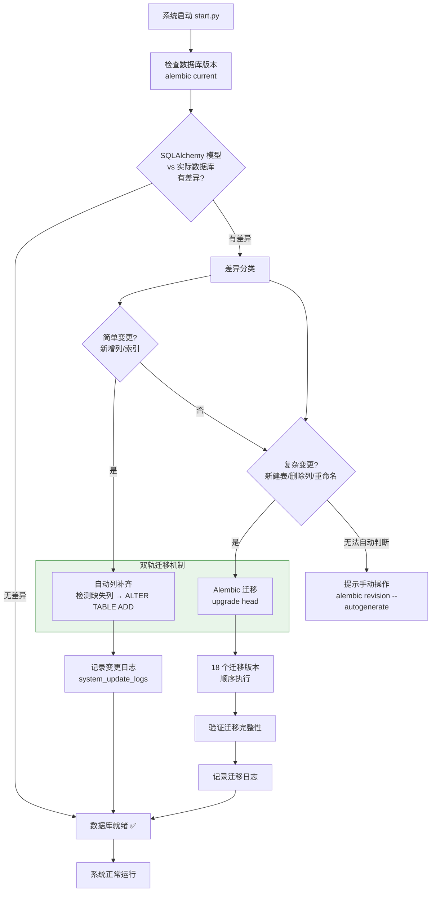

---

## 21. 构建流水线详细时序图

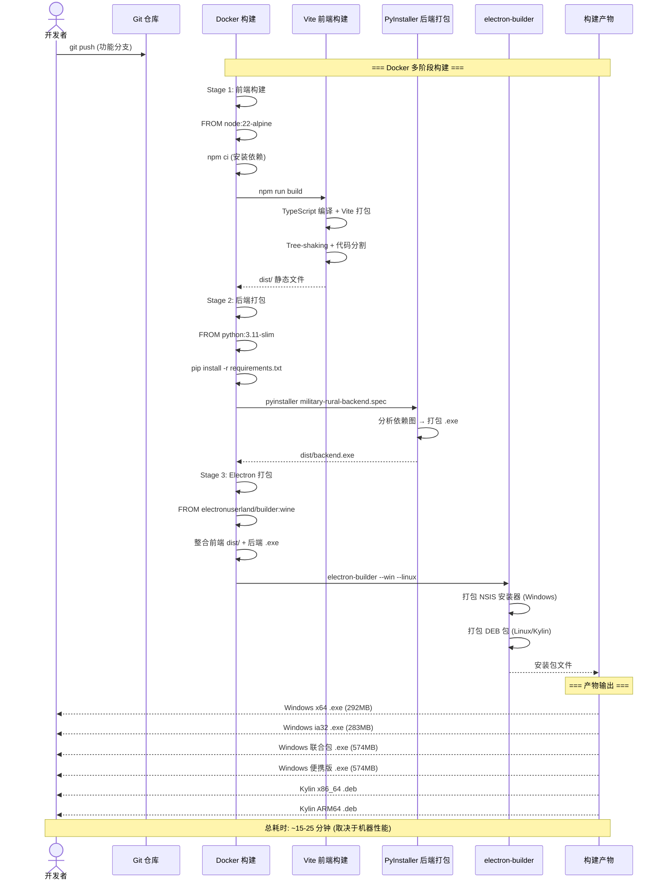

---

## 22. 离线地图瓦片架构图

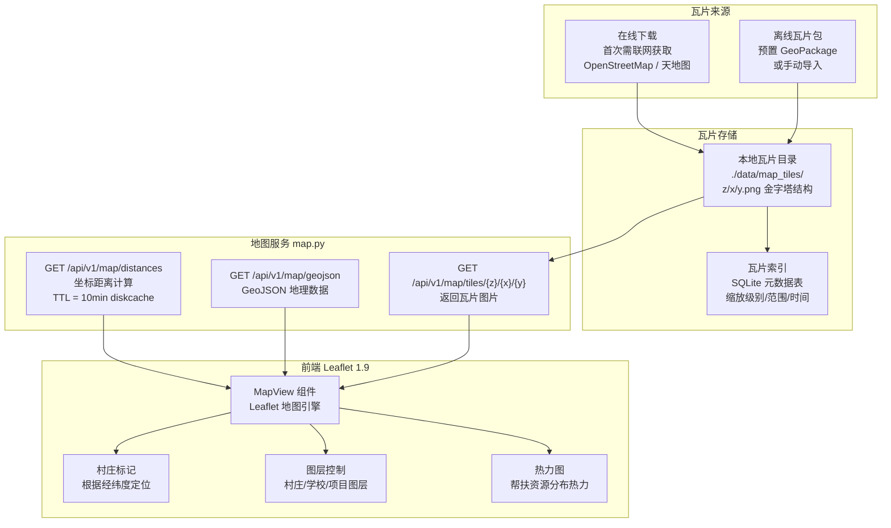

---

## 23. 消息通知流程图

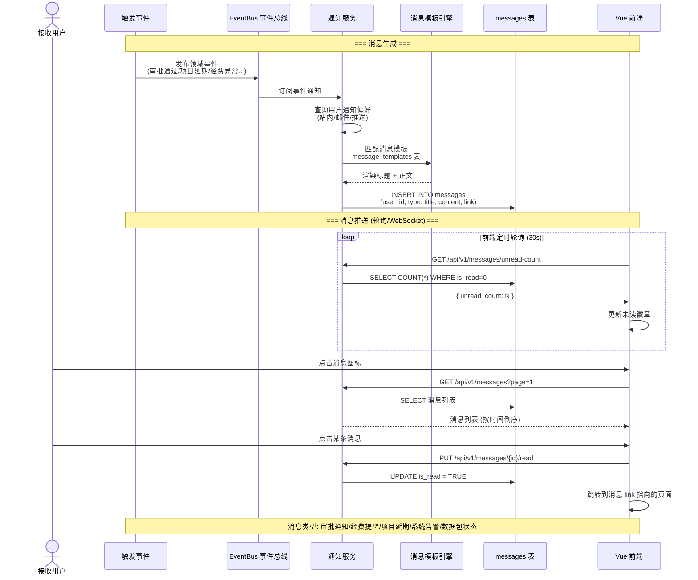

---

## 24. 系统配置层级图

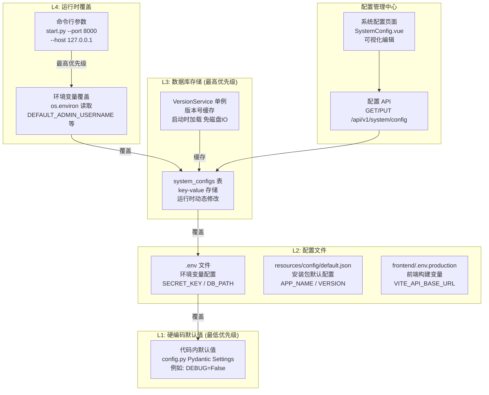

---

## 25. 数据包加密传输流程图

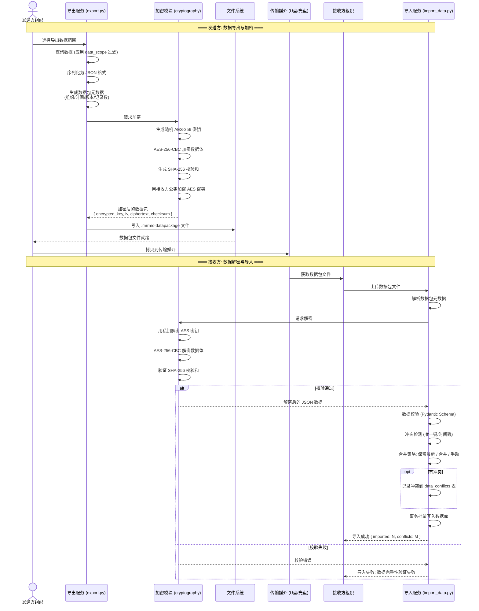

---

## 附注

- **格式**：所有图表使用 Mermaid 格式
- **本篇** 补充 14 幅图（#12–#25），加上前篇 11 幅（#1–#11），共计 **25 幅**
- **在线编辑导出**：[Mermaid Live Editor](https://mermaid.live/)

---

**系统版本**: 1.1.0 | **文档生成日期**: 2026-04-26 | **图表总数**: 25 幅
