# 军队乡村振兴管理系统 — 系统设计图集

**版本**: 1.1.0 | **生成日期**: 2026-04-26 | **格式**: Mermaid（可在 GitHub/GitLab/VS Code/Typora/Obsidian 中渲染）

在线编辑与导出 SVG/PNG：[Mermaid Live Editor](https://mermaid.live/)

---

## 目录

| # | 图表 | 类型 |
|---|------|------|
| 1 | [系统整体架构图](#1-系统整体架构图) | 架构拓扑 |
| 2 | [DDD 分层架构图](#2-ddd-分层架构图) | 分层依赖 |
| 3 | [部署架构图](#3-部署架构图) | CI/CD 部署 |
| 4 | [数据库 ER 图](#4-数据库-er-图) | 实体关系 |
| 5 | [数据流图](#5-数据流图) | 数据流转 |
| 6 | [认证与授权流程图](#6-认证与授权流程图) | 安全时序 |
| 7 | [API 请求处理流程图](#7-api-请求处理流程图) | 请求时序 |
| 8 | [审批工作流状态机](#8-审批工作流状态机) | 状态转换 |
| 9 | [经费生命周期状态图](#9-经费生命周期状态图) | 状态转换 |
| 10 | [前后端模块依赖图](#10-前后端模块依赖图) | 模块映射 |
| 11 | [前端组件树](#11-前端组件树) | 组件层次 |

---

## 1. 系统整体架构图

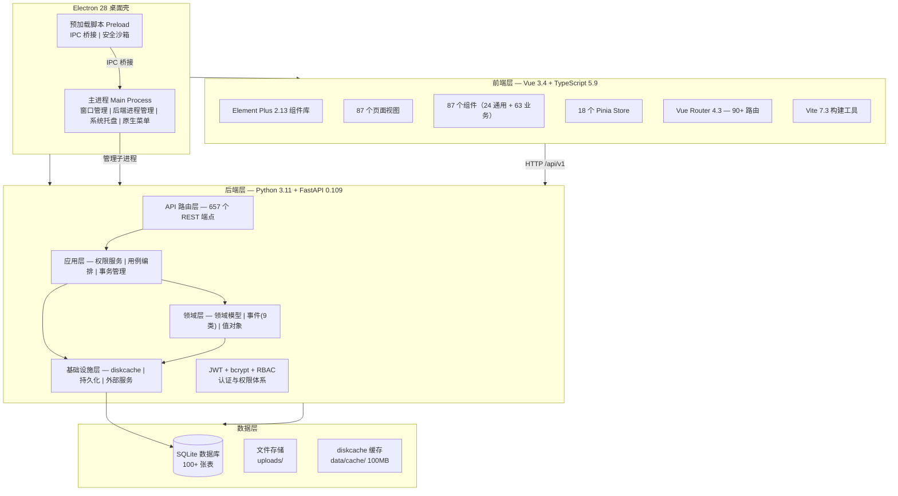

---

## 2. DDD 分层架构图

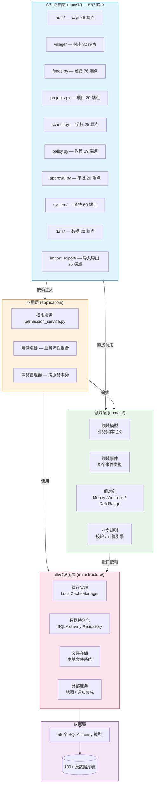

---

## 3. 部署架构图

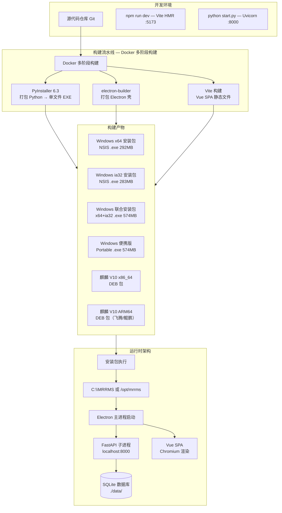

---

## 4. 数据库 ER 图

### 4.1 核心模块实体关系（12 大模块，100+ 表）

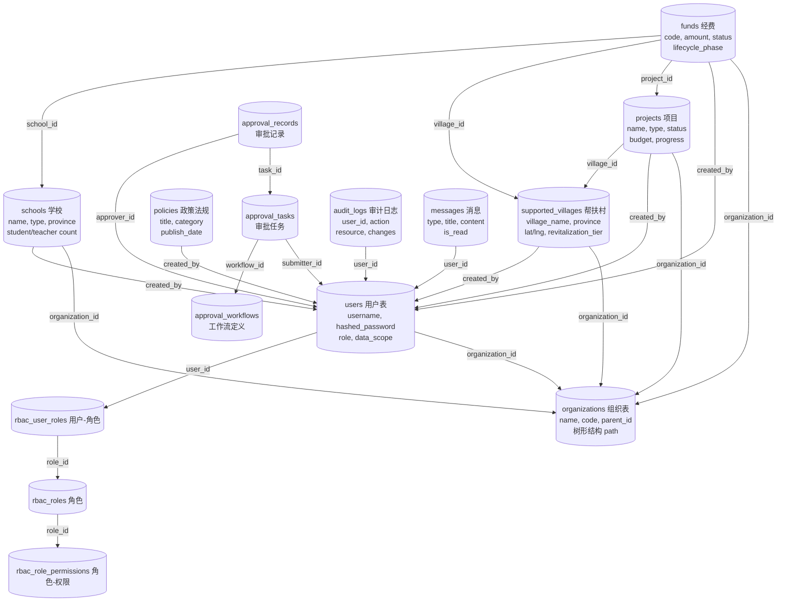

### 4.2 帮扶村 — 15 张年度数据子表

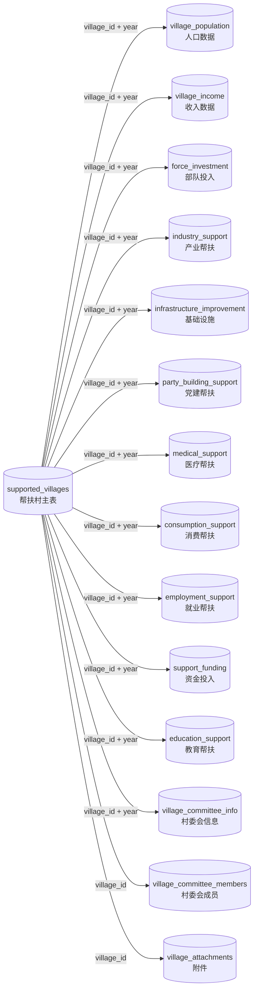

### 4.3 经费管理 — 15 张子表

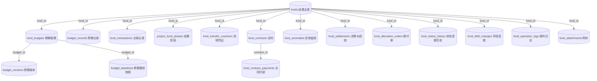

### 4.4 审批工作流 — 4 张表

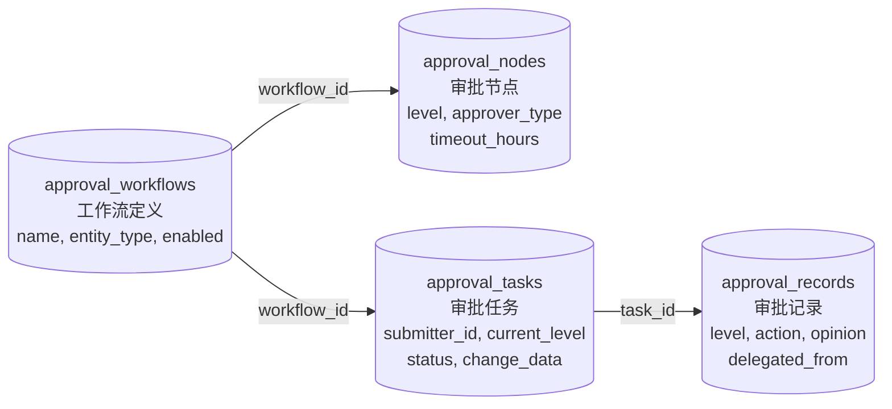

---

## 5. 数据流图

### 5.1 数据导入 / 导出 / 数据包 / 同步 总览

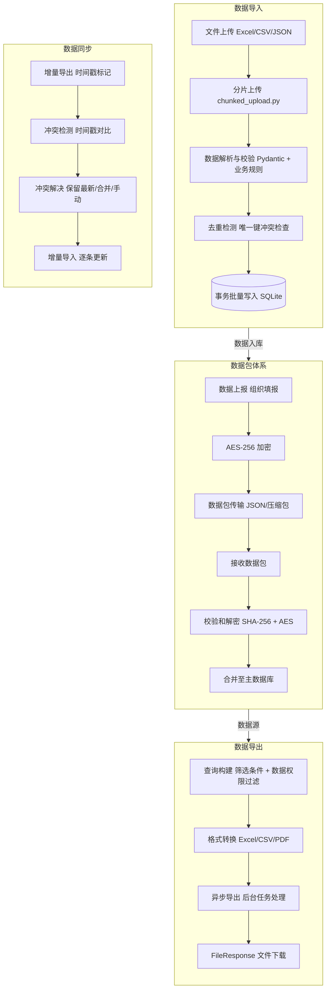

### 5.2 备份与恢复流程

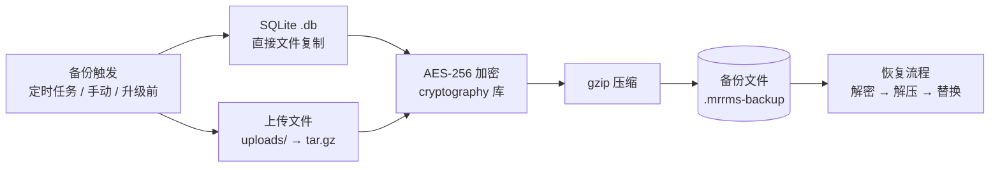

---

## 6. 认证与授权流程图

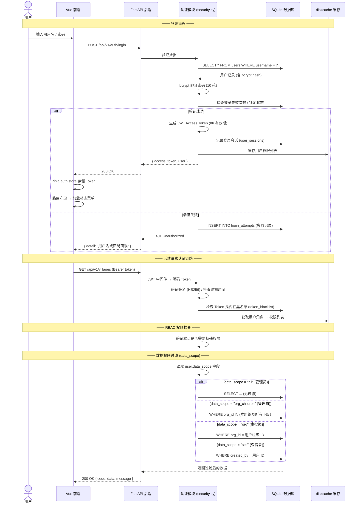

---

## 7. API 请求处理流程图

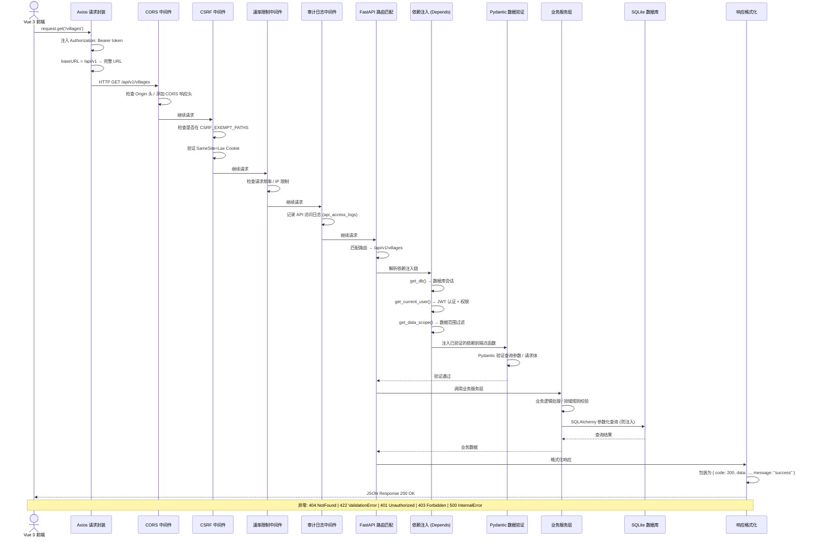

---

## 8. 审批工作流状态机

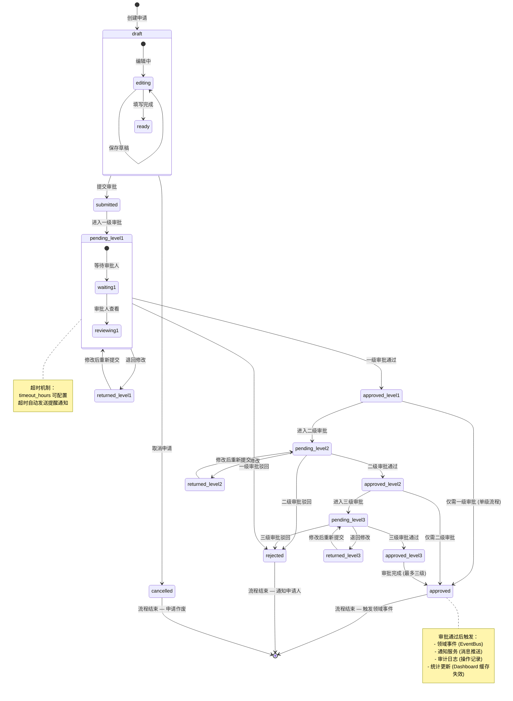

---

## 9. 经费生命周期状态图

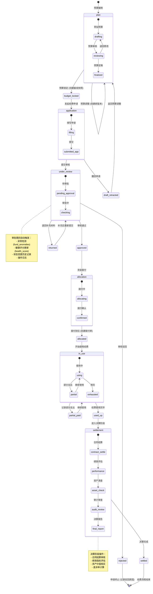

---

## 10. 前后端模块依赖图

```mermaid
graph TB
    subgraph PAGES["前端页面 (87 个)"]
        F_DASH["工作台 Dashboard"]
        F_VILLAGE["帮扶村管理"]
        F_SCHOOL["学校管理"]
        F_PROJECT["项目管理"]
        F_FUND["经费管理"]
        F_APPROVAL["审批工作流"]
        F_POLICY["政策法规"]
        F_ANALYTICS["数据分析"]
        F_SYSTEM["系统管理"]
        F_DATA["数据管理"]
        F_ORG["组织管理"]
    end

    subgraph STORES["Pinia Store (18 个)"]
        AUTH_S[auth.ts — 认证状态]
        USER_S[user.ts — 用户管理]
        APP_S[app.ts — 应用配置]
        VILLAGE_S[village.ts — 村庄数据]
        PROJECT_S[project.ts — 项目数据]
        FUNDS_S[funds.ts — 经费数据]
        RBAC_S[rbac.ts — 角色权限]
        ORG_S[organization.ts — 组织树]
        MENU_S[menu.ts — 菜单权限]
    end

    subgraph API_CLIENTS["API 客户端 (39 个文件)"]
        AUTH_API[auth API]
        VILLAGE_API[supportedVillage API]
        SCHOOL_API[schools API]
        PROJECT_API[projects API]
        FUND_API[funds API]
        FUND_LC_API[fundLifecycle API]
        APPROVAL_API[approval API]
        POLICY_API[policy API]
        ORG_API[organization API]
        SYSTEM_API[system API]
        DATA_API[dataPackage API]
    end

    subgraph BACKEND_EP["后端端点 (657 个)"]
        AUTH_EP["auth/ — 48 端点"]
        VILLAGE_EP["village/ — 68 端点"]
        SCHOOL_EP["school.py — 25 端点"]
        PROJECT_EP["projects.py — 30 端点"]
        FUND_EP["funds.py — 76 端点"]
        APPROVAL_EP["approval.py — 20 端点"]
        POLICY_EP["policy.py — 29 端点"]
        ORG_EP["organization.py — 13 端点"]
        SYSTEM_EP["system/ — 60 端点"]
        DATA_EP["import_export/ — 25 端点"]
    end

    F_DASH --> VILLAGE_S & PROJECT_S & FUNDS_S
    F_VILLAGE --> VILLAGE_S --> VILLAGE_API --> VILLAGE_EP
    F_SCHOOL --> SCHOOL_API --> SCHOOL_EP
    F_PROJECT --> PROJECT_S --> PROJECT_API --> PROJECT_EP
    F_FUND --> FUNDS_S --> FUND_API --> FUND_EP
    F_FUND --> FUND_LC_API --> FUND_EP
    F_APPROVAL --> APPROVAL_API --> APPROVAL_EP
    F_POLICY --> POLICY_API --> POLICY_EP
    F_ORG --> ORG_S --> ORG_API --> ORG_EP
    F_SYSTEM --> USER_S & RBAC_S --> SYSTEM_API --> SYSTEM_EP
    F_DATA --> DATA_API --> DATA_EP
```

---

## 11. 前端组件树

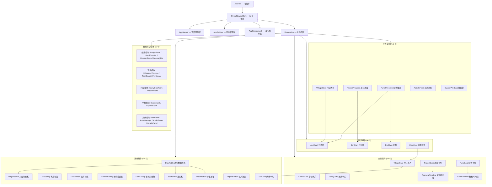

---

## 附注

- **格式**：所有图表使用 Mermaid 格式，可在 GitHub / GitLab / Gitee / VS Code / Typora / Obsidian 中直接渲染
- **在线编辑**：[Mermaid Live Editor](https://mermaid.live/) — 可粘贴代码、预览、导出为 SVG / PNG
- **数据库 ER 图** 分 4 个子图：核心模块 / 帮扶村子表 / 经费子表 / 审批表，完整系统包含 100+ 张表
- **颜色约定**：蓝=API 层 / 橙=应用层 / 绿=领域层 / 粉=基础设施层 / 紫=数据层
- **图表数量**：11 幅，涵盖架构、数据、流程、模块四大类

---

**系统版本**: 1.1.0 | **文档生成日期**: 2026-04-26
