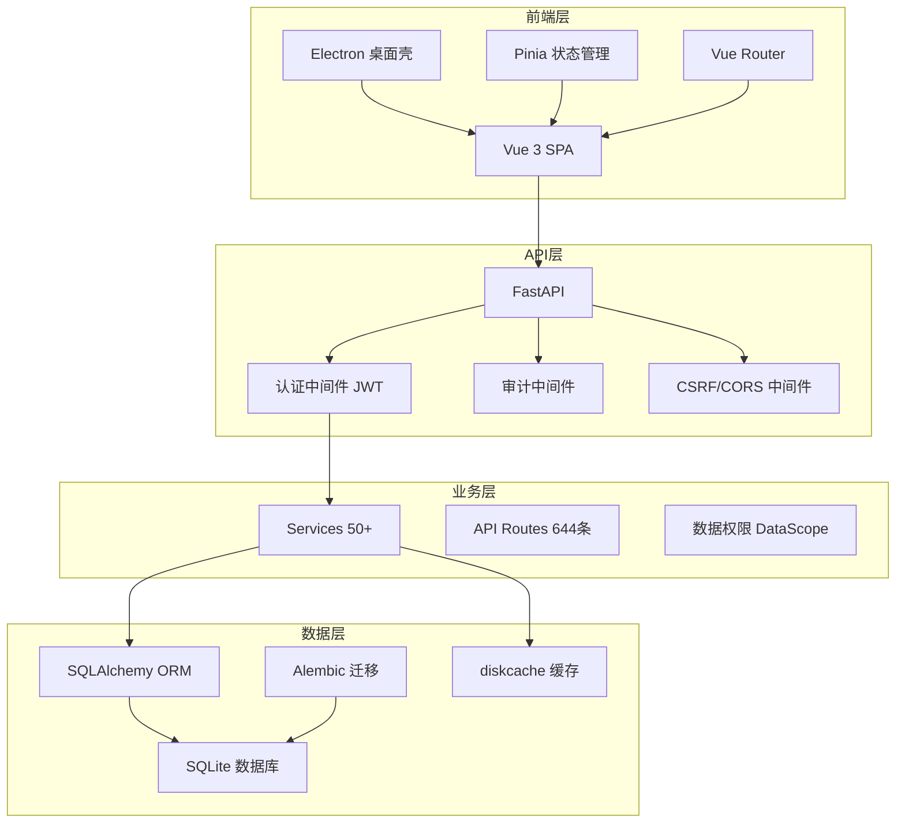

# 帮扶管理信息系统 - 数据库ER图

> 生成日期: 2026-05-31 | 后端模型: 54个 | 后端路由: 644条

## 核心业务实体关系图

```mermaid
erDiagram
    %% ==================== 核心组织 ====================
    Organization ||--o{ User : "所属"
    Organization ||--o{ Organization : "父子"
    Organization ||--o{ SupportedVillage : "管辖"
    Organization ||--o{ School : "管辖"
    Organization ||--o{ Fund : "所属"
    Organization ||--o{ DataPackage : "拥有"

    %% ==================== 用户与权限 ====================
    User ||--o{ AuditLog : "操作"
    User ||--o{ UserSession : "登录"
    User ||--o{ LoginAttempt : "登录尝试"
    User ||--o{ UserOrganization : "归属"
    User ||--o{ Todo : "待办"
    User ||--o{ Message : "接收"
    User ||--o{ ExportTask : "导出"
    User }o--|| RbacRole : "角色"

    RbacRole ||--o{ RolePermission : "权限"
    RbacRole ||--o{ UserRole : "分配"

    %% ==================== 帮扶村 ====================
    SupportedVillage ||--o{ AnnualIncome : "年度收入"
    SupportedVillage ||--o{ AnnualPopulation : "年度人口"
    SupportedVillage ||--o{ AnnualIndustry : "年度产业"
    SupportedVillage ||--o{ AnnualInfrastructure : "年度基建"
    SupportedVillage ||--o{ VillagePopulation : "人口"
    SupportedVillage ||--o{ VillageIncome : "收入"
    SupportedVillage ||--o{ Project : "帮扶项目"
    SupportedVillage ||--o{ FundBudget : "预算"
    SupportedVillage ||--o{ EffectivenessIndicator : "成效指标"

    %% ==================== 帮扶学校 ====================
    School ||--o{ Project : "帮扶项目"
    School ||--o{ Fund : "经费"

    %% ==================== 项目与经费 ====================
    Project ||--o{ Fund : "经费"
    Project ||--o{ ProjectMilestone : "里程碑"
    Project ||--o{ RuralWork : "乡村振兴工作"
    Project ||--o{ WorkLog : "工作日志"

    Fund ||--o{ FundTransaction : "交易记录"
    Fund ||--o{ FundStatusHistory : "状态变更"
    Fund ||--o{ FundAttachment : "附件"
    Fund ||--o{ FundAllocationOrder : "拨款单"
    Fund ||--o{ FundTransferVoucher : "转账凭证"
    Fund ||--o{ FundAssetVerification : "资产核验"
    FundBudget ||--o{ Fund : "预算关联"

    FundAllocationOrder ||--o{ AllocationOrderItem : "拨款项目"

    %% ==================== 审批流 ====================
    ApprovalWorkflow ||--o{ ApprovalNode : "节点"
    ApprovalWorkflow ||--o{ ApprovalTask : "任务"
    ApprovalTask ||--o{ ApprovalRecord : "审批记录"
    User ||--o{ ApprovalTask : "提交"
    User ||--o{ ApprovalRecord : "审批"

    %% ==================== 数据管理 ====================
    DataPackage ||--o{ DataReport : "报告"
    DataPackage ||--o{ PackageVersion : "版本"
    DataPackage ||--o{ PackageEditLog : "编辑日志"
    DataSyncLog ||--o{ DataConflict : "冲突"

    %% ==================== 政策与任务 ====================
    Policy ||--o{ Policy : "关联"
    RuralWork ||--o{ RuralTask : "子任务"

    %% ==================== 系统配置 ====================
    SystemConfig ||--o{ User : "默认配置"
    MachineCode ||--o{ Organization : "绑定"

    %% TABLE DEFINITIONS
    Organization {
        int id PK
        string name
        string code
        int parent_id FK
        string type
        datetime created_at
    }

    User {
        int id PK
        string username UK
        string hashed_password
        string full_name
        string email
        string role
        bool is_active
        bool is_superuser
        int organization_id FK
        datetime created_at
    }

    SupportedVillage {
        int id PK
        string village_name
        string province
        string county
        string town
        string revitalization_tier
        int organization_id FK
        string support_unit
        datetime created_at
    }

    School {
        int id PK
        string name
        string type
        string district
        string support_status
        int student_count
        int teacher_count
        int organization_id FK
        datetime created_at
    }

    Project {
        int id PK
        string name
        string status
        int village_id FK
        int school_id FK
        decimal budget
        date start_date
        date end_date
        datetime created_at
    }

    Fund {
        int id PK
        string name
        string fund_type
        string status
        decimal amount
        int project_id FK
        int village_id FK
        int school_id FK
        int organization_id FK
        datetime created_at
    }

    ApprovalWorkflow {
        int id PK
        string name
        string entity_type
        bool is_active
        int level_count
    }

    ApprovalTask {
        int id PK
        int workflow_id FK
        string entity_type
        int entity_id
        string status
        int submitter_id FK
        datetime created_at
    }

    DataPackage {
        int id PK
        string name
        string version
        string status
        int organization_id FK
        int created_by FK
        datetime created_at
    }
```

## 系统架构关系图

## 前端路由-视图映射

| 模块 | 路由数 | 关键路径 |
|------|--------|---------|
| 认证 | 5 | /login, /register, /forgot-password, /profile, /change-password |
| 工作台 | 1 | /dashboard |
| 帮扶村 | 3 | /supported-villages, /supported-villages/:id, /supported-villages/yearly |
| 帮扶项目 | 5 | /projects, /projects/:id, /projects/import, /projects/management |
| 经费管理 | 11 | /funds, /funds/analysis, /funds/budget, /funds/lifecycle, /funds/apply |
| 帮扶学校 | 4 | /schools, /schools/:id, /schools/:id/edit, /schools/analysis |
| 帮扶政策 | 3 | /policies, /policies/:id, /policies/:id/edit |
| 审批管理 | 4 | /approval, /approval/pending, /approval/my, /approval/history |
| 乡村振兴 | 3 | /rural-works, /rural-works/list, /rural-works/analysis |
| 数据分析 | 4 | /data-analysis, /data-analysis/dashboard, /data-analysis/map, /data-analysis/assessment |
| 数据管理 | 6 | /data-management, /data-management/backup, /data-management/logs, /data-sync/*, /data-package |
| 系统管理 | 10 | /system/users, /system/roles, /system/audit, /system/monitoring |
| 其他 | 5 | /organization, /message, /work-calendar, /help, /ai/interactive |

## 后端核心服务

| 服务 | 文件 | 职责 |
|------|------|------|
| AuthService | services/auth_service.py | 用户认证/授权 |
| VillageService | services/village_service.py | 帮扶村CRUD |
| FundService | services/fund_service.py | 经费管理 |
| ProjectService | services/project_service.py | 项目管理 |
| ApprovalService | services/approval_service.py | 审批流 |
| ReportService | services/report_service.py | 报表生成 |
| BackupService | services/backup_service.py | 数据备份 |
| CacheService | services/cache_service.py | 缓存管理 |
| DataMaskingService | services/data_masking_service.py | 数据脱敏 |
| EncryptionService | services/encryption_service.py | 加密 |
| SyncService | services/sync_service.py | 数据同步 |
| RBACService | services/rbac_service.py | 角色权限 |
| AIService | services/ai_service.py | AI分析 |
