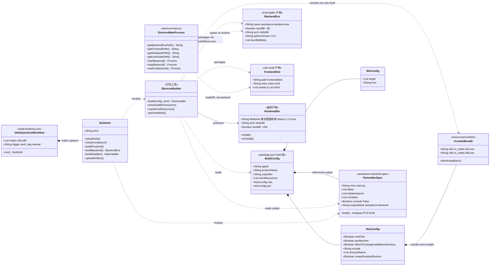
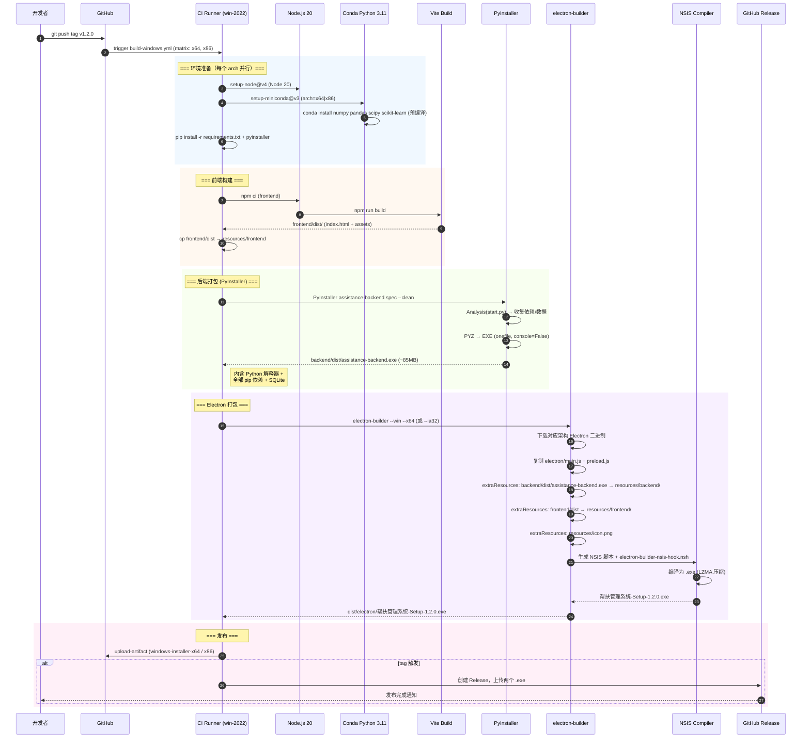
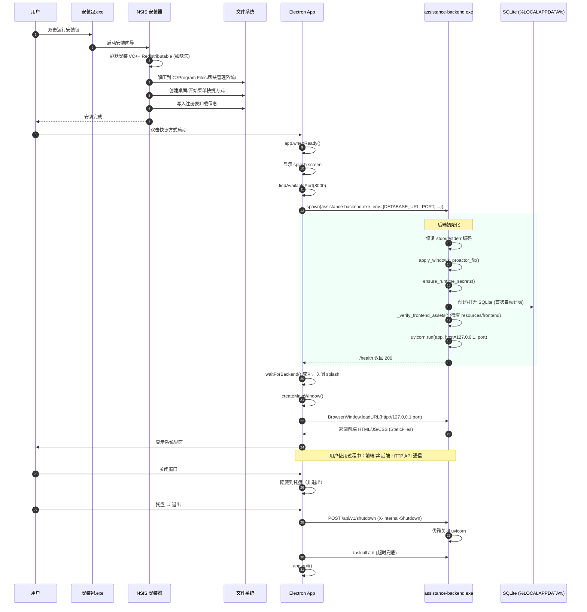
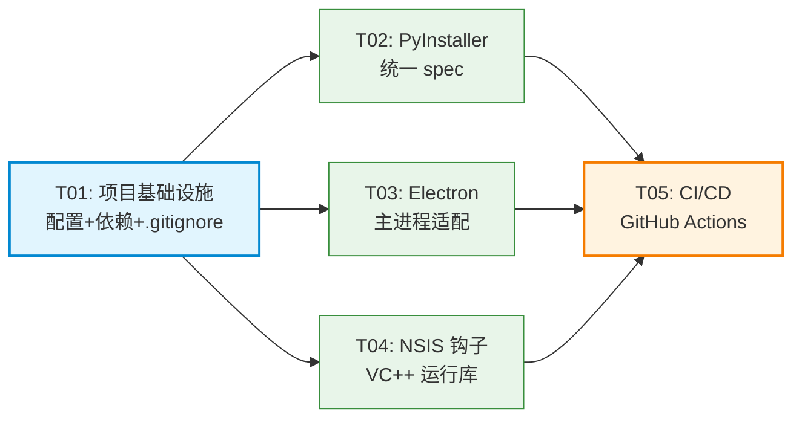

# 帮扶管理信息系统 — Windows x64/x86 离线安装包打包方案（系统设计）

> 架构师：高见远（Gao）  
> 版本：1.0  
> 日期：2026-06-24  
> 范围：Windows x64 / x86 离线 .exe 安装包的构建、打包与 CI/CD 自动化

---

## Part A: 系统设计

### 1. 实现方案与框架选型

#### 1.1 核心技术挑战

| # | 挑战 | 难点分析 |
|---|------|----------|
| C1 | **Python 运行时离线打包** | 目标机器无 Python，需将解释器 + 全部 pip 依赖（含 numpy/scipy/pandas/sklearn 等重型 C 扩展）+ SQLite 打包为独立 .exe |
| C2 | **x64 与 x86 双架构** | PyInstaller 产物架构由 Python 解释器架构决定，需分别用 64-bit / 32-bit Python 构建；Electron 也需对应架构的 electron 二进制 |
| C3 | **VC++ 运行库依赖** | numpy/bcrypt/cryptography 等 C 扩展依赖 vcruntime140.dll / msvcp140.dll；目标机器（尤其 Win7）可能未安装 VC++ Redistributable |
| C4 | **Electron + Python 进程通信** | Electron 主进程通过 `child_process.spawn` 启动 backend.exe，经 HTTP（127.0.0.1）通信，需处理端口冲突、健康检查、优雅退出 |
| C5 | **数据持久化与权限** | SQLite 数据库必须放在用户可写目录（%APPDATA%），不能放 Program Files（安装目录），否则非管理员用户写入失败 |
| C6 | **现有代码不一致** | main.js 期望 `assistance-backend.exe`，PyInstaller spec 产出 `assistance-management-backend.exe`，package.json extraResources 路径不匹配；现有 build-windows.yml 使用原始 NSIS 但引用了从未创建的目录 |

#### 1.2 方案选型：方案 A — PyInstaller + electron-builder

经过评估三个候选方案，**选定方案 A**：

| 方案 | 机制 | 优点 | 缺点 | 结论 |
|------|------|------|------|------|
| **A. PyInstaller** | 将 backend 打包为单文件 .exe，内含 Python 解释器 + 全部依赖；electron-builder 将其作为 extraResources 打入 NSIS 安装包 | 目标机零依赖；与现有 spec/start.py 兼容；CI 成熟 | 单文件启动需解压（+2-3s）；体积较大（~85MB） | ✅ **选定** |
| B. 嵌入式 Python | 下载 python-embed.zip + pip install 到本地目录 | 体积可控 | 配置复杂；需处理 sys.path/_pth；多目录部署易出错 | ❌ |
| C. Nuitka | 编译为 C 代码再编译为原生二进制 | 性能最优；体积最小 | 编译时间长（30min+）；部分包兼容性差；CI 复杂 | ❌ |

**选定理由**：
1. 项目已有 `backend/start.py`（PyInstaller 入口）和 `assistance-management-backend.spec`，方案 A 改造成本最低
2. PyInstaller 对 FastAPI + SQLAlchemy + numpy/scipy 生态兼容性验证充分（本地已成功产出 85MB exe）
3. electron-builder 原生支持 NSIS target + x64/ia32 架构矩阵，可替代 7 个手写 .nsi 文件
4. 目标用户为军事/政务系统，稳定性优先于体积

#### 1.3 架构模式

```
┌─────────────────────────────────────────────────────────┐
│                   NSIS 安装包 (.exe)                      │
│  ┌───────────────────────────────────────────────────┐  │
│  │  Electron 运行时 (Chromium + Node.js)              │  │
│  │  ┌─────────────┐    ┌──────────────────────────┐  │  │
│  │  │  main.js     │───▶│  child_process.spawn()   │  │  │
│  │  │  (主进程)     │    │  启动 assistance-backend  │  │  │
│  │  └──────┬───────┘    │  .exe (PyInstaller 产物)  │  │  │
│  │         │ HTTP        └────────────┬─────────────┘  │  │
│  │         ▼                          │                 │  │
│  │  ┌─────────────┐                   ▼                 │  │
│  │  │ BrowserWindow│◀──── FastAPI + Uvicorn (内嵌 Python) │  │
│  │  │ (前端 UI)    │     ┌──────────────────────────┐   │  │
│  │  │ loadURL()    │     │ SQLite │ numpy │ pandas  │   │  │
│  │  └─────────────┘     │ bcrypt │ cryptography     │   │  │
│  │                       └──────────────────────────┘   │  │
│  │  resources/backend/assistance-backend.exe            │  │
│  │  resources/frontend/  (Vue3 静态产物)                 │  │
│  │  resources/icon.png                                  │  │
│  └───────────────────────────────────────────────────┘  │
│                                                          │
│  数据目录（运行时创建，非安装目录）:                        │
│    %LOCALAPPDATA%\bumofu-assistance\data\*.db            │
│    %LOCALAPPDATA%\bumofu-assistance\logs\                │
│    %LOCALAPPDATA%\bumofu-assistance\uploads\             │
└─────────────────────────────────────────────────────────┘
```

**关键设计决策**：
- **backend.exe 采用 PyInstaller `--onefile` 模式**：单文件便于 electron-builder 通过 extraResources 打包；启动时解压到临时目录（splash screen 覆盖等待时间）
- **前端不打包进 backend.exe**：Electron 通过 `FRONTEND_DIST_PATH` 环境变量告知后端静态资源位置（`resources/frontend/`），避免重复打包（节省 ~15MB）
- **electron-builder 替代手写 NSIS**：利用 electron-builder 内置 NSIS target 处理快捷方式、卸载器、注册表；通过 `nsis.include` 钩子注入 VC++ Redistributable 静默安装

---

### 2. 文件列表

#### 2.1 需新建文件

| 相对路径 | 用途 |
|----------|------|
| `backend/assistance-backend.spec` | 统一 PyInstaller 打包配置（x64/x86 通用），产出 `assistance-backend.exe` |
| `build-scripts/electron-builder-nsis-hook.nsh` | electron-builder NSIS 钩子脚本：VC++ Redistributable 静默安装 + 卸载清理 + 进程终止 |
| `environment.yml` | Conda 环境定义（numpy/scipy/pandas 等重型依赖预编译包，CI 缓存键） |
| `backend/requirements-build.txt` | 构建专用依赖（pyinstaller + 构建工具），不污染运行时 requirements.txt |

#### 2.2 需修改文件

| 相对路径 | 修改要点 |
|----------|----------|
| `package.json` | 修复 `build.extraResources` 路径与名称；添加 `build.nsis` 配置（include 钩子、perMachine、快捷方式）；添加 `build:win-x64` / `build:win-x86` 脚本；版本号与 config.py 对齐 |
| `electron/main.js` | 确认 `getBackendExePath()` 产出名与 spec 一致（`assistance-backend.exe`）；补全 `getDatabasePath()` 指向 userData 目录；确认 `getFrontendPath()` 在 packaged 模式正确 |
| `.github/workflows/build-windows.yml` | 重写为 electron-builder 流水线（替代原始 NSIS）；修正 matrix；添加 environment.yml 缓存；tag 触发 Release |
| `Makefile` | 添加 `build-win-x64` / `build-win-x86` / `build-win-all` 目标 |
| `.gitignore` | 添加 `backend/dist/`、`backend/build/`、`dist/electron/`、`build/dist/` 等构建产物 |
| `build-scripts/build-config.json` | 更新 windows.arch 为 `["x64","x86"]`；更新 backend_entry 引用 |
| `build-scripts/README.md` | 更新构建说明，标注 electron-builder 为唯一 Windows 打包路径 |

#### 2.3 可废弃文件（建议删除，避免混淆）

| 相对路径 | 废弃原因 |
|----------|----------|
| `build-scripts/installer-combined.nsi` | 引用不存在的 `build/pkg-combined/`，已被 electron-builder NSIS 替代 |
| `build-scripts/installer-fixed.nsi` | 同上，废弃 |
| `build-scripts/installer-x86.nsi` | 同上，废弃 |
| `build-scripts/installer.nsi` | 同上，废弃 |
| `build-scripts/installer-simple.nsi` | 当前 workflow 使用但引用不存在的 `build/pkg-x64/`，废弃 |
| `build-scripts/installer_x64.nsi` | 手写 NSIS，被 electron-builder 替代 |
| `build-scripts/installer_x86.nsi` | 同上 |
| `backend/assistance-management-backend.spec` | 产出名不匹配，被 `assistance-backend.spec` 替代 |
| `backend/assistance-management-backend-x86.spec` | 与主 spec 几乎重复（PyInstaller 架构由解释器决定，无需分文件） |
| `backend/assistance-management-backend-full.spec` | console=True 且 hiddenimports 包含又排除 magic（自相矛盾），废弃 |
| `build-scripts/build_windows_complete.bat` | 手动构建脚本，被 CI/Makefile 替代 |
| `build-scripts/build_windows_x64_complete.bat` | 同上 |
| `build-scripts/build_windows_x86_complete.bat` | 同上 |

---

### 3. 数据结构与接口（类图）

> 详见 `docs/class-diagram.mermaid`



---

### 4. 程序调用流程（时序图）

> 详见 `docs/sequence-diagram.mermaid`

#### 4.1 CI/CD 构建流程



#### 4.2 运行时启动流程



---

### 5. x64/x86 双架构构建矩阵设计

#### 5.1 架构对照表

| 维度 | x64 | x86 (ia32) |
|------|-----|------------|
| **Python 解释器** | conda win-64 (64-bit Python 3.11) | conda win-32 (32-bit Python 3.11) |
| **PyInstaller 产物** | assistance-backend.exe (64-bit) | assistance-backend.exe (32-bit) |
| **Electron 架构** | electron-v33-win32-x64 | electron-v33-win32-ia32 |
| **electron-builder 参数** | `--win --x64` | `--win --ia32` |
| **VC++ Redistributable** | vc_redist.x64.exe | vc_redist.x86.exe |
| **安装目录** | `$PROGRAMFILES64` | `$PROGRAMFILES32` |
| **numpy/scipy/pandas** | conda-forge 预编译 | conda-forge 预编译 (win-32) |
| **prophet** | ✅ 可用 | ❌ 无 32-bit 包，运行时降级 |
| **目标系统** | Win7/10/11 x64 | Win7/10 x86 (32-bit OS) |

#### 5.2 GitHub Actions Matrix

```yaml
strategy:
  fail-fast: false
  matrix:
    include:
      - arch: x64
        conda-arch: x64
        eb-arch: x64
        vcredist: vc_redist.x64.exe
      - arch: x86
        conda-arch: x86
        eb-arch: ia32
        vcredist: vc_redist.x86.exe
```

#### 5.3 x86 特殊处理

1. **prophet 降级**：x86 无 prophet 预编译包，构建时跳过安装；后端 `app/services/` 中 prophet 调用已有 try/except 保护，运行时自动降级为线性回归
2. **scipy/scikit-learn**：conda-forge 提供 win-32 包，正常安装
3. **Electron ia32**：Electron 33 仍发布 ia32 Windows 构建；electron-builder `--ia32` 自动下载对应架构
4. **内存限制**：32-bit 进程上限 ~2GB，大型数据分析（pandas 大表）需注意；不影响日常 CRUD 操作

---

### 6. NSIS 安装脚本设计要点

#### 6.1 安装目录结构（安装后）

```
C:\Program Files\帮扶管理系统\          (x64) 或 C:\Program Files (x86)\帮扶管理系统\ (x86)
├── 帮扶管理系统.exe                     (Electron 主程序, electron-builder 生成)
├── resources/
│   ├── app.asar                        (Electron 应用包：main.js + preload.js)
│   ├── backend/
│   │   └── assistance-backend.exe      (PyInstaller 产物, ~85MB)
│   ├── frontend/                       (Vue3 静态产物)
│   │   ├── index.html
│   │   ├── assets/
│   │   └── ...
│   └── icon.png
├── vcredist/
│   └── vc_redist.x64.exe (或 .x86.exe) (VC++ 运行库安装器)
└── ... (Electron 运行时 DLL)
```

#### 6.2 数据目录结构（运行时，非安装目录）

```
%LOCALAPPDATA%\bumofu-assistance\       (由 backend paths.py 自动创建)
├── data/
│   └── rural_revitalization.db         (SQLite 数据库)
├── logs/
│   └── app.log
├── uploads/                            (用户上传文件)
├── exports/                            (导出文件)
├── cache/                              (diskcache 缓存)
├── backups/                            (自动备份)
├── runtime_secrets.json                (自动生成的密钥)
└── window-state.json                   (窗口位置记忆)
```

> **关键**：数据库放在 `%LOCALAPPDATA%` 而非安装目录，避免 Program Files 权限问题。由 Electron `main.js` 通过 `DATABASE_URL` 环境变量注入，backend `paths.py` 中 `is_bundled()` 检测 PyInstaller 冻结状态后自动切换。

#### 6.3 electron-builder NSIS 配置（package.json build.nsis）

```jsonc
"nsis": {
  "oneClick": false,                          // 非一键安装，显示安装向导
  "perMachine": true,                         // 安装到所有用户 (Program Files)
  "allowToChangeInstallationDirectory": true, // 允许用户选择安装路径
  "installerIcon": "resources/icons/app.ico",
  "uninstallerIcon": "resources/icons/app.ico",
  "include": "build-scripts/electron-builder-nsis-hook.nsh",  // 自定义钩子
  "shortcutName": "帮扶管理系统",
  "createDesktopShortcut": true,
  "createStartMenuShortcut": true,
  "deleteAppDataOnUninstall": false           // 卸载时保留用户数据
}
```

#### 6.4 electron-builder-nsis-hook.nsh 设计要点

该 `.nsh` 文件通过 electron-builder 的 `nsis.include` 注入到生成的 NSIS 脚本中，实现以下功能：

| 功能 | 实现方式 |
|------|----------|
| **VC++ 运行库静默安装** | `${If} $R0 == "x64"` 判断架构 → `ExecWait '"$INSTDIR\resources\vcredist\vc_redist.x64.exe" /install /quiet /norestart'`；安装失败不阻断（PyInstaller 已捆绑核心 DLL） |
| **安装前终止旧进程** | `nsExec::Exec 'taskkill /F /IM 帮扶管理系统.exe /IM assistance-backend.exe'`（升级覆盖安装时） |
| **卸载前终止运行进程** | 同上，避免文件占用导致卸载失败 |
| **卸载数据清理（可选）** | 询问用户是否删除 `%LOCALAPPDATA%\bumofu-assistance\` 数据目录 |
| **注册表卸载信息** | electron-builder 自动处理，钩子补充 `DisplayIcon`、`Publisher` |
| **开机自启（可选）** | 写入 `HKCU\Software\Microsoft\Windows\CurrentVersion\Run`（默认不启用） |

#### 6.5 VC++ 运行库处理策略

```
策略：双保险
├── Layer 1: PyInstaller 自动捆绑
│   └── vcruntime140.dll, vcruntime140_1.dll, msvcp140.dll
│       → 打包进 assistance-backend.exe，运行时解压到临时目录
│       → 后端 .exe 本身不依赖系统 VC++ 运行库
├── Layer 2: NSIS 钩子静默安装 Redistributable
│   └── vc_redist.x64.exe /install /quiet /norestart
│       → 覆盖 Electron 运行时及系统级 C++ 组件需求
│       → 安装失败不阻断（Layer 1 已兜底后端）
└── 结果：目标机器无需预装任何 VC++ 运行库
```

---

### 7. GitHub Actions Workflow 设计

#### 7.1 触发条件

| 触发方式 | 条件 | 用途 |
|----------|------|------|
| `push tags` | `v*` (如 v1.2.0) | 正式发布，构建 + 创建 Release |
| `push branches` | `main` | 主干提交验证构建 |
| `workflow_dispatch` | 手动触发 | 按需构建（可选指定 arch） |

#### 7.2 完整 Workflow 结构

```yaml
name: Build Windows Installer (x64 & x86)

on:
  push:
    branches: [main]
    tags: ['v*']
  workflow_dispatch:
    inputs:
      arch:
        description: 'Architecture (x64, x86, both)'
        required: false
        default: 'both'

env:
  NODE_VERSION: '20'
  PYTHON_VERSION: '3.11'

jobs:
  build-windows:
    runs-on: windows-2022
    timeout-minutes: 90
    strategy:
      fail-fast: false
      matrix:
        include:
          - arch: x64
            conda-arch: x64
            eb-arch: x64
          - arch: x86
            conda-arch: x86
            eb-arch: ia32

    steps:
      # 1. Checkout
      - uses: actions/checkout@v4

      # 2. Node.js (for electron-builder + frontend)
      - uses: actions/setup-node@v4
        with:
          node-version: ${{ env.NODE_VERSION }}
          cache: 'npm'

      # 3. Conda (统一管理 Python + 重型 C 扩展)
      - uses: conda-incubator/setup-miniconda@v3
        with:
          python-version: ${{ env.PYTHON_VERSION }}
          architecture: ${{ matrix.conda-arch }}
          activate-environment: build
          auto-activate-base: false
          use-only-tar-bz2: true

      # 4. 缓存 Conda 包
      - uses: actions/cache@v4
        with:
          path: ~/conda_pkgs_dir
          key: ${{ runner.os }}-conda-${{ matrix.arch }}-${{ hashFiles('environment.yml') }}
          restore-keys: ${{ runner.os }}-conda-${{ matrix.arch }}-

      # 5. 安装重型依赖 (conda 预编译, 避免 x86 源码编译)
      - name: Install heavy deps via Conda
        shell: bash -l {0}
        run: |
          conda install -c conda-forge numpy pandas scipy scikit-learn openpyxl -y
          if [[ "${{ matrix.arch }}" == "x64" ]]; then
            conda install -c conda-forge prophet -y
          fi

      # 6. 前端依赖缓存 + 构建
      - uses: actions/cache@v4
        with:
          path: frontend/node_modules
          key: ${{ runner.os }}-fe-${{ hashFiles('frontend/package-lock.json') }}
      - name: Build frontend
        run: |
          cd frontend && npm ci --legacy-peer-deps && npm run build
      - name: Sync frontend to resources
        run: |
          New-Item -ItemType Directory -Force -Path resources/frontend | Out-Null
          Copy-Item -Path frontend/dist/* -Destination resources/frontend -Recurse -Force
        shell: pwsh

      # 7. 版本同步 (tag 触发)
      - name: Sync version
        if: startsWith(github.ref, 'refs/tags/v')
        run: python scripts/sync_version.py ${{ github.ref_name }}

      # 8. 安装 Python 依赖 + PyInstaller
      - name: Install Python deps
        shell: bash -l {0}
        run: |
          pip install --upgrade pip cython setuptools wheel
          pip install -r backend/requirements.txt
          pip install -r backend/requirements-build.txt

      # 9. PyInstaller 打包后端
      - name: Build backend (PyInstaller)
        shell: bash -l {0}
        run: cd backend && python -m PyInstaller assistance-backend.spec --clean --noconfirm

      # 10. 验证后端产物
      - name: Verify backend exe
        shell: pwsh
        run: |
          if (-not (Test-Path "backend/dist/assistance-backend.exe")) {
            throw "backend exe not found"
          }
          Write-Host "Backend exe size: $((Get-Item backend/dist/assistance-backend.exe).Length / 1MB)MB"

      # 11. 安装 Electron 依赖
      - name: Install Electron deps
        run: npm ci

      # 12. electron-builder 打包 (核心步骤)
      - name: Build installer (electron-builder)
        run: npx electron-builder --win --${{ matrix.eb-arch }}
        env:
          GH_TOKEN: ${{ secrets.GITHUB_TOKEN }}

      # 13. 上传制品
      - uses: actions/upload-artifact@v4
        with:
          name: windows-installer-${{ matrix.arch }}
          path: dist/electron/*.exe
          retention-days: 30

      # 14. 发布 Release (仅 tag 触发)
      - name: Release
        if: startsWith(github.ref, 'refs/tags/v')
        uses: softprops/action-gh-release@v2
        with:
          files: dist/electron/*.exe
          generate_release_notes: true
```

#### 7.3 缓存策略

| 缓存项 | 路径 | 键 | 命中场景 |
|--------|------|-----|----------|
| Conda 包 | `~/conda_pkgs_dir` | `Windows-conda-{arch}-{hash(environment.yml)}` | 依赖未变时跳过下载 |
| 前端 node_modules | `frontend/node_modules` | `Windows-fe-{hash(package-lock.json)}` | 前端依赖未变时跳过 npm ci |
| 根 node_modules | `node_modules` | `Windows-root-{hash(package.json)}` | electron-builder 依赖未变 |
| PyInstaller 缓存 | 无（`--clean` 强制重建） | — | 确保产物一致性 |

---

### 8. 依赖包列表

#### 8.1 新增构建依赖（backend/requirements-build.txt）

```
pyinstaller==6.11.1      # Python 打包为独立 .exe
cython>=3.0.0            # 部分包构建依赖
setuptools>=69.0.0       # 构建工具
wheel>=0.42.0            # wheel 格式支持
```

#### 8.2 现有 Node.js 依赖（package.json devDependencies，已存在）

```
electron@^33.4.0         # Electron 桌面运行时
electron-builder@^24.13.3 # 打包工具（含 NSIS 编译器）
```

#### 8.3 Conda 重型依赖（environment.yml）

```yaml
name: build
channels:
  - conda-forge
dependencies:
  - python=3.11
  - numpy
  - pandas
  - scipy
  - scikit-learn
  - openpyxl
  - matplotlib    # x64 only, x86 跳过 prophet
  # prophet 仅 x64 添加（CI 中条件安装）
```

#### 8.4 运行时依赖（backend/requirements.txt，无需修改）

全部 pip 依赖由 PyInstaller 捆绑进 assistance-backend.exe，目标机器无需安装。

---

### 9. 共享知识（跨文件约定）

#### 9.1 后端可执行文件名称约定

```
统一名称：assistance-backend.exe（Windows）/ assistance-backend（Linux）

涉及文件：
├── backend/assistance-backend.spec     → name='assistance-backend'
├── electron/main.js getBackendExePath() → exeName='assistance-backend.exe'  ✅ 已一致
├── package.json build.extraResources   → from:'backend/dist/assistance-backend.exe', to:'backend/'
└── build-scripts/electron-builder-nsis-hook.nsh → taskkill /IM assistance-backend.exe
```

> ⚠️ **当前不一致**：spec 产出 `assistance-management-backend.exe`，需改为 `assistance-backend`。

#### 9.2 资源路径解析（dev vs production）

| 资源 | 开发模式 (`!app.isPackaged`) | 打包模式 (`app.isPackaged`) |
|------|------|------|
| backend.exe | `backend/dist/assistance-backend.exe` | `process.resourcesPath/backend/assistance-backend.exe` |
| frontend | `frontend/dist/` | `process.resourcesPath/frontend/` |
| icon | `resources/icon.png` | `process.resourcesPath/icon.png` |
| DB 路径 | `./data/rural_revitalization.db` | `%LOCALAPPDATA%/bumofu-assistance/data/rural_revitalization.db` |

**路径注入链**：
1. Electron `main.js` → `getDatabasePath()` 返回 userData 下路径
2. → 通过 `env.DATABASE_URL = sqlite:///${dbPath}` 传给 backend.exe
3. → backend `config.py` 读取 `DATABASE_URL` 环境变量
4. → `paths.py` 中 `is_bundled()`（检测 `sys.frozen`）作为兜底默认值

#### 9.3 DB 路径策略

```
%LOCALAPPDATA%\bumofu-assistance\data\rural_revitalization.db
```

- **为什么不用安装目录**：Program Files 需要管理员权限写入；非管理员用户运行时会失败
- **为什么不用 %APPDATA%（漫游）**：数据库文件大，漫游会拖慢登录；使用 %LOCALAPPDATA%（不漫游）
- **Electron userData**：`app.getPath('userData')` 默认为 `%APPDATA%\帮扶管理系统`，用于存储 window-state.json、secrets.json 等小文件
- **backend 数据目录**：`paths.py get_app_data_dir()` 返回 `%LOCALAPPDATA%\bumofu-assistance`，用于 DB、uploads、logs 等大文件

#### 9.4 端口冲突处理

```
Electron main.js 端口选择策略：
1. DEFAULT_BACKEND_PORT = 8000
2. findAvailablePort(8000, maxAttempts=11)  → 尝试 8000-8010
3. 找到可用端口 → 通过 env.PORT 传给 backend.exe
4. 全部占用 → dialog.showErrorBox + app.quit()

backend.exe 端口监听：
1. 读取 env.PORT（Electron 注入）
2. uvicorn.run(host='127.0.0.1', port=env.PORT)
3. 仅监听回环地址，不暴露到网络
```

#### 9.5 进程生命周期管理

```
启动：Electron whenReady → spawn(backend.exe) → waitForBackend(/health) → loadURL
退出：Electron before-quit → POST /shutdown → taskkill /f /t (3s 超时兜底)
崩溃：backend exit(code≠0) → 自动重启 (max 3 次) → 超限弹窗 + 日志路径
```

#### 9.6 API 响应格式约定（已存在，不变）

| 格式 | 结构 | 使用场景 |
|------|------|----------|
| 裸格式 | `{total, page, page_size, items}` | 列表接口 |
| 信封格式 | `{code:200, data:{...}, message:"成功"}` | 认证、用户、RBAC |

#### 9.7 版本号同步

```
版本号权威来源：package.json → version
同步链：
  package.json (1.2.0)
    ├── scripts/sync_version.py → backend/app/core/config.py Settings.PROJECT_VERSION
    ├── electron/main.js → 从 package.json 读取 appVersion
    └── electron-builder → 自动使用 package.json version 命名安装包

tag 触发时 CI 执行 sync_version.py 同步版本号后再构建
```

---

### 10. 待明确事项（UNCLEAR）

| # | 事项 | 当前假设 | 需确认 |
|---|------|----------|--------|
| U1 | **electron/main.js 存根函数** | `getDatabasePath()`、`getOrCreateSecrets()` 等为存根（`/* ... */`），假设实际部署版本已实现 | 需确认 main.js 是否有完整实现版本；若无，需补全 `getDatabasePath()` 返回 `path.join(getUserDataPath(), 'data', 'rural_revitalization.db')` |
| U2 | **Electron 33 ia32 支持范围** | 假设 Electron 33 仍发布 win-ia32 构建 | 需在 CI 首次构建时验证 `electron-builder --ia32` 能否成功下载 ia32 Electron |
| U3 | **Windows 7 兼容性** | 假设目标含 Win7；PyInstaller + Python 3.11 官方仅支持 Win8.1+ | 如需 Win7，需降至 Python 3.8（PyInstaller 兼容）或使用 embedded 方案；**建议确认目标系统最低版本** |
| U4 | **安装包体积上限** | 预估 x64 ~250MB、x86 ~200MB（LZMA 压缩后） | 军事系统如有体积限制需确认；可通过移除 prophet/scipy 进一步缩减 |
| U5 | **代码签名** | 当前无代码签名证书 | 政府/军事系统可能要求 Authenticode 签名；如有证书需在 electron-builder `win.certificateFile` 配置 |
| U6 | **prophet x86 降级影响** | 假设 prophet 调用处已有 try/except 保护 | 需确认 `app/services/` 中预测功能在 prophet 缺失时是否优雅降级 |
| U7 | **前端是否需打包进 backend.exe** | 设计中移除（Electron 单独提供），但 standalone 后端模式将无前端 | 如需 backend.exe 独立运行（无 Electron）提供 Web UI，需保留前端打包 |

---

## Part B: 任务分解

### 11. 任务列表（按依赖顺序）

#### T01: 项目基础设施与配置统一

- **任务名**：项目基础设施（配置文件 + 依赖声明 + .gitignore）
- **源文件**：
  - `package.json`（修改：build.extraResources 路径修复、build.nsis 配置、build:win-x64/x86 脚本）
  - `backend/requirements-build.txt`（新建：pyinstaller 等构建依赖）
  - `environment.yml`（新建：conda 重型依赖定义）
  - `.gitignore`（修改：添加构建产物忽略规则）
  - `build-scripts/build-config.json`（修改：arch 改为双架构）
- **依赖**：无
- **优先级**：P0
- **说明**：统一所有配置文件中的后端 exe 名称为 `assistance-backend`；配置 electron-builder NSIS 选项；声明构建依赖。这是所有后续任务的基础。

#### T02: PyInstaller 统一打包配置

- **任务名**：PyInstaller 统一 spec（x64/x86 通用）
- **源文件**：
  - `backend/assistance-backend.spec`（新建：统一 spec，产出 assistance-backend.exe，移除冗余前端打包）
  - `backend/assistance-management-backend.spec`（废弃/删除：被新 spec 替代）
  - `backend/assistance-management-backend-x86.spec`（废弃/删除：架构由解释器决定，无需分文件）
  - `backend/start.py`（修改：确认 frozen 模式路径处理与新 spec 兼容）
- **依赖**：T01
- **优先级**：P0
- **说明**：创建单一 spec 文件，PyInstaller 产物架构由运行时的 Python 解释器架构决定（64-bit Python → x64 exe，32-bit Python → x86 exe），无需维护两份 spec。移除 `datas` 中的 `resources/frontend`（Electron 单独提供），减少 ~15MB 体积。

#### T03: Electron 主进程与资源路径适配

- **任务名**：Electron main.js 路径适配与存根补全
- **源文件**：
  - `electron/main.js`（修改：确认 getBackendExePath 名称一致；补全 getDatabasePath() 指向 userData；确认 packaged 模式路径）
  - `electron/preload.js`（修改：确认 IPC handler 与 packaged 模式兼容）
  - `electron/splash.html`（修改：确认打包后资源路径正确）
- **依赖**：T01
- **优先级**：P0
- **说明**：确保 Electron 在 packaged 模式下能正确定位 backend.exe、frontend 静态资源、数据库路径。重点修复 `getDatabasePath()` 存根函数，使其返回 `%LOCALAPPDATA%/bumofu-assistance/data/rural_revitalization.db`。

#### T04: NSIS 安装钩子与 VC++ 运行库处理

- **任务名**：electron-builder NSIS 钩子脚本
- **源文件**：
  - `build-scripts/electron-builder-nsis-hook.nsh`（新建：VC++ 静默安装 + 进程终止 + 卸载清理）
  - `build-scripts/installer-simple.nsi`（废弃/删除：被 electron-builder 内置 NSIS 替代）
  - `build-scripts/README.md`（修改：更新构建说明）
- **依赖**：T01
- **优先级**：P1
- **说明**：编写 electron-builder `nsis.include` 钩子脚本，实现 VC++ Redistributable 静默安装（双保险）、安装/卸载前进程终止、卸载时数据清理询问。清理 7 个废弃的 .nsi 文件。

#### T05: GitHub Actions CI/CD 流水线与 Makefile

- **任务名**：CI/CD 重写 + Makefile 集成
- **源文件**：
  - `.github/workflows/build-windows.yml`（重写：electron-builder matrix 流水线）
  - `Makefile`（修改：添加 build-win-x64 / build-win-x86 / build-win-all 目标）
  - `scripts/sync_version.py`（修改：确认版本同步逻辑与新流程兼容）
- **依赖**：T01、T02、T03、T04
- **优先级**：P0
- **说明**：重写 build-windows.yml，使用 electron-builder 替代原始 NSIS 步骤；修正 x64/x86 matrix；添加 environment.yml 缓存；tag 触发自动创建 Release。Makefile 添加本地构建快捷命令。

---

### 12. 任务依赖图



**依赖说明**：
- T01 是所有任务的基础（配置统一）
- T02、T03、T04 可在 T01 完成后**并行开发**（互相独立）
- T05 依赖 T01-T04 全部完成（CI 需调用所有产物）
- 关键路径：T01 → T02 → T05（PyInstaller spec 是构建核心）

---

### 13. 共享知识补充（工程师实施指南）

#### 13.1 后端 exe 名称变更影响清单

```
变更：assistance-management-backend.exe → assistance-backend.exe

受影响文件：
1. backend/assistance-backend.spec          → name='assistance-backend'  [新建]
2. package.json build.extraResources        → from:'backend/dist/assistance-backend.exe'
3. electron/main.js getBackendExePath()      → 已是 'assistance-backend.exe'  ✅ 无需改
4. build-scripts/electron-builder-nsis-hook.nsh → taskkill /IM assistance-backend.exe
5. .github/workflows/build-windows.yml      → 验证步骤检查 assistance-backend.exe
6. Makefile                                  → PyInstaller 命令使用新 spec 名
```

#### 13.2 electron-builder extraResources 配置要点

```jsonc
"extraResources": [
  {
    "from": "backend/dist/assistance-backend.exe",
    "to": "backend/assistance-backend.exe",
    "filter": ["**/*"]
  },
  {
    "from": "frontend/dist",
    "to": "frontend",
    "filter": ["**/*"]
  },
  {
    "from": "resources/vcredist",
    "to": "vcredist",
    "filter": ["**/*.exe"]
  },
  {
    "from": "resources/icon.png",
    "to": "icon.png"
  }
]
```

> 注意：`from` 路径相对于项目根目录；`to` 路径相对于 `resources/` 目录（electron-builder 自动放置在 `process.resourcesPath` 下）。

#### 13.3 PyInstaller spec 关键修改点

```python
# 1. 产出名称统一
exe = EXE(..., name='assistance-backend', ...)  # 非 'assistance-management-backend'

# 2. 移除前端打包（Electron 单独提供）
datas = [
    (os.path.join(backend_dir, 'alembic'), 'alembic'),
    (os.path.join(backend_dir, '.env.example'), '.'),
    (os.path.join(backend_dir, 'app'), 'app'),
    # 移除：(frontend_dir, 'resources/frontend')  ← Electron 通过 extraResources 提供
]

# 3. 移除前端存在性检查（不再硬依赖 resources/frontend）
# 删除：if not os.path.isdir(frontend_dir): raise FileNotFoundError(...)

# 4. console=False（无控制台窗口，由 Electron 管理）
```

#### 13.4 electron-builder --arch 参数对照

| electron-builder 参数 | 对应架构 | 安装目录 | Electron 下载 |
|----------------------|---------|---------|--------------|
| `--x64` | 64-bit (amd64) | Program Files | electron-v33-win32-x64.zip |
| `--ia32` | 32-bit (x86) | Program Files (x86) | electron-v33-win32-ia32.zip |

#### 13.5 本地构建验证命令

```bash
# 前端构建
cd frontend && npm run build

# 后端打包（需对应架构 Python）
cd backend && python -m PyInstaller assistance-backend.spec --clean --noconfirm

# Electron 打包（x64）
npx electron-builder --win --x64

# 产物位置
# dist/electron/帮扶管理系统-Setup-1.2.0.exe
```

---

## 附录 A: 现有代码问题诊断

| 问题 | 位置 | 严重性 | 修复任务 |
|------|------|--------|----------|
| 后端 exe 名称三方不一致 | main.js vs spec vs package.json | 🔴 高 | T01 + T02 |
| build-windows.yml NSIS 步骤引用不存在的目录 | `installer-simple.nsi` → `build/pkg-x64/` | 🔴 高 | T05 |
| build-windows.yml 未使用 electron-builder | 缺少 Electron 运行时 | 🔴 高 | T05 |
| environment.yml 不存在导致缓存失效 | cache key 引用 | 🟡 中 | T01 |
| 7 个 .nsi 文件冗余冲突 | build-scripts/ | 🟡 中 | T04 |
| main.js 存根函数未实现 | getDatabasePath() 等 | 🟡 中 | T03 |
| PyInstaller spec 重复打包前端 | datas 含 resources/frontend | 🟢 低 | T02 |
| x86 spec 与主 spec 重复 | 无需分文件 | 🟢 低 | T02 |
